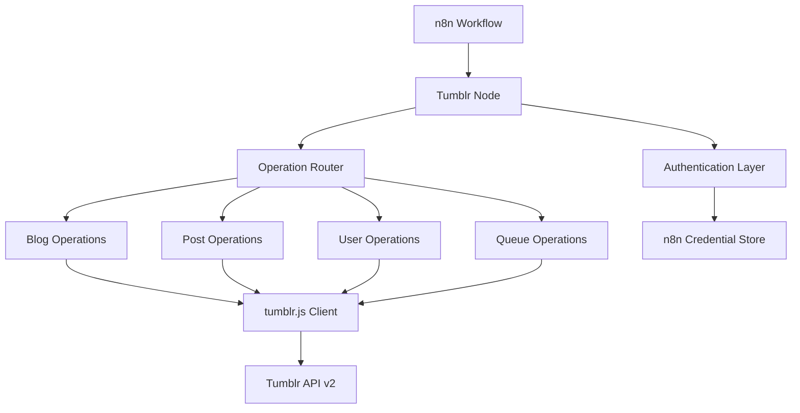
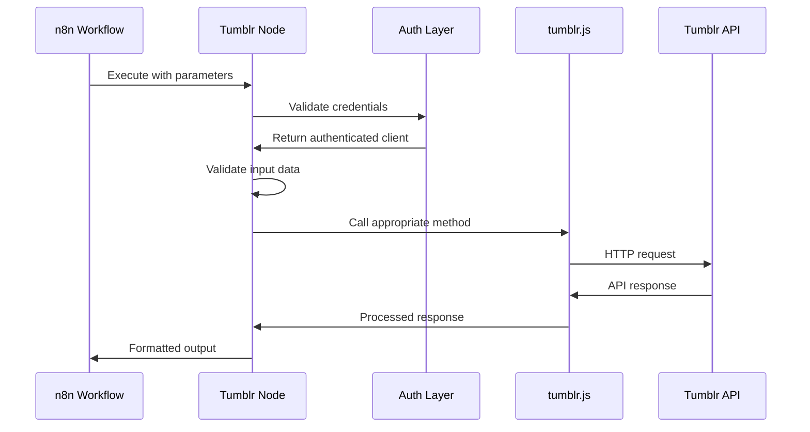

# Design Document

## Overview

The Tumblr integration for n8n will be implemented as a custom node that leverages the tumblr.js@5.0.1 npm package to interact with Tumblr's API v2. The integration follows n8n's node architecture patterns and provides comprehensive functionality for content management, social interactions, and workflow automation.

The design emphasizes modularity, security, and performance while maintaining compatibility with n8n's existing infrastructure. The integration will support OAuth 2.0 authentication, multiple content types, queue management, and robust error handling.

## Architecture

### High-Level Architecture



### Node Architecture

The Tumblr integration will consist of the following components:

**Core Node Files:**
- `Tumblr.node.ts` - Main node implementation with operation routing
- `TumblrTrigger.node.ts` - Trigger node for webhook-based workflows (future enhancement)

**Credential Management:**
- `TumblrOAuth2Api.credentials.ts` - OAuth 2.0 credential configuration

**Operation Descriptions:**
- `BlogDescription.ts` - Blog-related operations and parameters
- `PostDescription.ts` - Post creation and management operations
- `UserDescription.ts` - User profile and social operations
- `QueueDescription.ts` - Queue and draft management operations

**Helper Methods:**
- `loadOptions.ts` - Dynamic option loading for dropdowns
- `listSearch.ts` - Search functionality for blogs and content

### Data Flow Architecture



## Components and Interfaces

### Authentication Component

**OAuth 2.0 Implementation:**

```typescript
interface TumblrCredentials {
  clientId: string;
  clientSecret: string;
  accessToken: string;
  refreshToken?: string;
  tokenType: 'Bearer';
  expiresAt?: number;
}

class TumblrAuthenticator {
  async authenticate(credentials: TumblrCredentials): Promise<TumblrClient>;
  async refreshToken(credentials: TumblrCredentials): Promise<TumblrCredentials>;
  async validateCredentials(credentials: TumblrCredentials): Promise<boolean>;
}
```

**Credential Configuration:**

```typescript
export class TumblrOAuth2Api implements ICredentialType {
  name = 'tumblrOAuth2Api';
  displayName = 'Tumblr OAuth2 API';
  documentationUrl = 'https://www.tumblr.com/docs/api/v2';
  
  properties: INodeProperties[] = [
    {
      displayName: 'Grant Type',
      name: 'grantType',
      type: 'hidden',
      default: 'authorizationCode',
    },
    {
      displayName: 'Authorization URL',
      name: 'authUrl',
      type: 'hidden',
      default: 'https://www.tumblr.com/oauth2/authorize',
    },
    {
      displayName: 'Access Token URL',
      name: 'accessTokenUrl',
      type: 'hidden',
      default: 'https://api.tumblr.com/v2/oauth2/token',
    },
    {
      displayName: 'Client ID',
      name: 'clientId',
      type: 'string',
      required: true,
    },
    {
      displayName: 'Client Secret',
      name: 'clientSecret',
      type: 'string',
      typeOptions: { password: true },
      required: true,
    },
    {
      displayName: 'Scope',
      name: 'scope',
      type: 'hidden',
      default: 'write',
    },
  ];
}
```

### Operation Router Component

```typescript
interface OperationConfig {
  resource: 'blog' | 'post' | 'user' | 'queue' | 'draft';
  operation: string;
  parameters: IDataObject;
}

class OperationRouter {
  async route(config: OperationConfig, client: TumblrClient): Promise<IDataObject>;
  private async executeBlogOperation(operation: string, params: IDataObject, client: TumblrClient): Promise<IDataObject>;
  private async executePostOperation(operation: string, params: IDataObject, client: TumblrClient): Promise<IDataObject>;
  private async executeUserOperation(operation: string, params: IDataObject, client: TumblrClient): Promise<IDataObject>;
  private async executeQueueOperation(operation: string, params: IDataObject, client: TumblrClient): Promise<IDataObject>;
}
```

### Post Management Component

```typescript
interface PostCreationParams {
  blogName: string;
  type: 'text' | 'photo' | 'quote' | 'link' | 'chat' | 'video' | 'audio';
  title?: string;
  body?: string;
  caption?: string;
  tags?: string[];
  state?: 'published' | 'draft' | 'queue' | 'private';
  format?: 'html' | 'markdown';
  publishOn?: string;
  // Type-specific fields
  photos?: Array<{ url: string; caption?: string; altText?: string }>;
  quote?: string;
  source?: string;
  url?: string;
  description?: string;
  conversation?: Array<{ name: string; label: string; phrase: string }>;
  videoUrl?: string;
  audioUrl?: string;
}

class PostManager {
  async createPost(params: PostCreationParams, client: TumblrClient): Promise<IDataObject>;
  async updatePost(postId: string, params: Partial<PostCreationParams>, client: TumblrClient): Promise<IDataObject>;
  async deletePost(blogName: string, postId: string, client: TumblrClient): Promise<IDataObject>;
  async getPost(blogName: string, postId: string, client: TumblrClient): Promise<IDataObject>;
  async getPosts(blogName: string, filters: IDataObject, client: TumblrClient): Promise<IDataObject>;
}
```

### Queue Management Component

```typescript
interface QueueParams {
  blogName: string;
  postId?: string;
  publishOn?: string;
  tags?: string[];
  state?: 'queue' | 'draft';
}

class QueueManager {
  async addToQueue(params: QueueParams, client: TumblrClient): Promise<IDataObject>;
  async getQueue(blogName: string, client: TumblrClient): Promise<IDataObject>;
  async removeFromQueue(blogName: string, postId: string, client: TumblrClient): Promise<IDataObject>;
  async reorderQueue(blogName: string, postIds: string[], client: TumblrClient): Promise<IDataObject>;
}
```

## Data Models

### Core Data Structures

**Tumblr Post Model:**

```typescript
interface TumblrPost {
  id: string;
  type: 'text' | 'photo' | 'quote' | 'link' | 'chat' | 'video' | 'audio';
  blog_name: string;
  post_url: string;
  timestamp: number;
  date: string;
  tags: string[];
  state: 'published' | 'draft' | 'queue' | 'private';
  format: 'html' | 'markdown';
  reblog_key?: string;
  slug?: string;
  summary?: string;
  note_count: number;
  
  // Type-specific fields
  title?: string;
  body?: string;
  caption?: string;
  photos?: Photo[];
  quote?: string;
  source?: string;
  url?: string;
  description?: string;
  conversation?: Conversation[];
  video_url?: string;
  audio_url?: string;
  audio_source_url?: string;
  track_name?: string;
  artist?: string;
  album?: string;
}

interface Photo {
  caption: string;
  alt_sizes: Array<{
    url: string;
    width: number;
    height: number;
  }>;
  original_size: {
    url: string;
    width: number;
    height: number;
  };
}

interface Conversation {
  name: string;
  label: string;
  phrase: string;
}
```

**Blog Information Model:**

```typescript
interface BlogInfo {
  title: string;
  name: string;
  description: string;
  url: string;
  uuid: string;
  updated: number;
  posts: number;
  followers?: number;
  total_posts: number;
  share_likes: boolean;
  share_following: boolean;
  can_be_followed: boolean;
  theme: {
    header_full_width: number;
    header_full_height: number;
    header_focus_width: number;
    header_focus_height: number;
    avatar_shape: string;
    background_color: string;
    body_font: string;
    header_bounds: string;
    header_image: string;
    header_image_focused: string;
    header_image_scaled: string;
    header_stretch: boolean;
    link_color: string;
    show_avatar: boolean;
    show_description: boolean;
    show_header_image: boolean;
    show_title: boolean;
    title_color: string;
    title_font: string;
    title_font_weight: string;
  };
}
```

**User Information Model:**

```typescript
interface UserInfo {
  name: string;
  likes: number;
  following: number;
  default_post_format: string;
  blogs: BlogInfo[];
}
```

### Input/Output Data Mapping

**Node Input Structure:**

```typescript
interface NodeInputData {
  resource: string;
  operation: string;
  blogName?: string;
  postId?: string;
  postType?: string;
  title?: string;
  body?: string;
  tags?: string;
  state?: string;
  additionalFields?: IDataObject;
}
```

**Node Output Structure:**

```typescript
interface NodeOutputData {
  success: boolean;
  data: IDataObject;
  metadata?: {
    operation: string;
    timestamp: string;
    blogName?: string;
    postId?: string;
  };
}
```

## Error Handling

### Error Classification System

```typescript
enum TumblrErrorType {
  AUTHENTICATION = 'authentication',
  RATE_LIMIT = 'rate_limit',
  NETWORK = 'network',
  VALIDATION = 'validation',
  API_ERROR = 'api_error',
  UNKNOWN = 'unknown'
}

interface TumblrError {
  type: TumblrErrorType;
  code: number;
  message: string;
  details?: IDataObject;
  timestamp: string;
  retryable: boolean;
  retryAfter?: number;
}

class ErrorHandler {
  classifyError(error: any): TumblrError;
  formatErrorMessage(error: TumblrError): string;
  shouldRetry(error: TumblrError): boolean;
  getRetryDelay(error: TumblrError, attempt: number): number;
}
```

### Rate Limiting Strategy

```typescript
class RateLimitHandler {
  private requestCounts: Map<string, number> = new Map();
  private resetTimes: Map<string, number> = new Map();
  
  async checkRateLimit(userId: string): Promise<boolean>;
  async handleRateLimit(error: TumblrError): Promise<void>;
  private async waitForReset(resetTime: number): Promise<void>;
  private calculateBackoffDelay(attempt: number): number;
}
```

### Retry Mechanism

```typescript
class RetryHandler {
  async executeWithRetry<T>(
    operation: () => Promise<T>,
    maxRetries: number = 3,
    baseDelay: number = 1000
  ): Promise<T>;
  
  private async delay(ms: number): Promise<void>;
  private calculateExponentialBackoff(attempt: number, baseDelay: number): number;
}
```

## Testing Strategy

### Unit Testing Approach

**Test Structure:**

```typescript
describe('TumblrNode', () => {
  describe('Authentication', () => {
    it('should authenticate with valid OAuth credentials');
    it('should handle authentication failures gracefully');
    it('should refresh expired tokens automatically');
  });
  
  describe('Post Operations', () => {
    it('should create text posts with all parameters');
    it('should create photo posts with image uploads');
    it('should update existing posts correctly');
    it('should delete posts with confirmation');
    it('should handle invalid post data appropriately');
  });
  
  describe('Error Handling', () => {
    it('should classify different error types correctly');
    it('should implement retry logic for transient failures');
    it('should respect rate limiting constraints');
  });
});
```

**Mock Strategy:**

```typescript
class MockTumblrClient {
  async createTextPost(blogName: string, params: IDataObject): Promise<IDataObject>;
  async getBlogInfo(blogName: string): Promise<IDataObject>;
  async getUserInfo(): Promise<IDataObject>;
  // Mock implementations for all API methods
}

class MockCredentialStore {
  async getCredentials(nodeCredentials: INodeCredentialsDetails): Promise<ICredentialsDecrypted>;
  // Mock credential management
}
```

### Integration Testing

**Test Scenarios:**

1. **End-to-End Workflow Testing:**
   - Complete authentication flow
   - Post creation and management lifecycle
   - Queue operations with scheduling
   - Error recovery scenarios

2. **API Integration Testing:**
   - Real Tumblr API interaction (with test account)
   - Rate limiting behavior validation
   - Error response handling
   - Data consistency verification

3. **Performance Testing:**
   - Concurrent operation handling
   - Large file upload performance
   - Memory usage monitoring
   - Response time measurement

### Test Data Management

```typescript
interface TestDataSet {
  validCredentials: TumblrCredentials;
  testBlogName: string;
  samplePosts: {
    text: PostCreationParams;
    photo: PostCreationParams;
    quote: PostCreationParams;
    link: PostCreationParams;
  };
  invalidInputs: IDataObject[];
  errorScenarios: Array<{
    scenario: string;
    mockResponse: any;
    expectedError: TumblrError;
  }>;
}
```

## Security Considerations

### Authentication Security

1. **OAuth 2.0 Implementation:**
   - PKCE (Proof Key for Code Exchange) support
   - Secure token storage with encryption
   - Automatic token refresh handling
   - Scope limitation to required permissions

2. **Credential Management:**
   - Integration with n8n's encrypted credential store
   - No plaintext credential storage
   - Secure credential validation
   - Multi-account support with isolation

### Data Protection

1. **Input Validation:**
   - Sanitization of all user inputs
   - Type checking and format validation
   - Prevention of injection attacks
   - File upload security measures

2. **API Security:**
   - HTTPS-only communication
   - Request signing and validation
   - Rate limiting compliance
   - Error message sanitization

### Privacy Compliance

1. **Data Handling:**
   - Minimal data retention
   - User consent for data processing
   - Secure data transmission
   - Audit logging for compliance

## Performance Optimization

### Caching Strategy

```typescript
class CacheManager {
  private cache: Map<string, { data: any; expiry: number }> = new Map();
  
  async get(key: string): Promise<any | null>;
  async set(key: string, data: any, ttl: number): Promise<void>;
  async invalidate(pattern: string): Promise<void>;
  private isExpired(expiry: number): boolean;
}
```

### Request Optimization

1. **Batch Operations:**
   - Combine multiple API calls where possible
   - Efficient pagination handling
   - Bulk data processing

2. **Connection Management:**
   - HTTP connection pooling
   - Keep-alive connections
   - Request queuing and throttling

### Memory Management

1. **Resource Cleanup:**
   - Proper disposal of large objects
   - Stream processing for file uploads
   - Memory leak prevention

2. **Efficient Data Structures:**
   - Optimized data serialization
   - Minimal object creation
   - Garbage collection optimization

This design provides a comprehensive foundation for implementing the Tumblr integration while ensuring scalability, security, and maintainability. The modular architecture allows for easy testing and future enhancements while following n8n's established patterns and best practices.